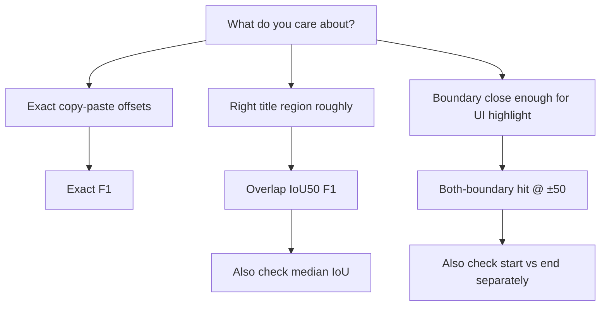

# Metrics explained — title span benchmark

This guide explains every metric in the [pilot title benchmark](PILOT_TITLE_BENCHMARK_REPORT.md), with **worked examples** and **diagrams**.

All spans use **half-open character intervals** `[start, end)` — `start` is inclusive, `end` is exclusive (same convention as Python slicing).

---

## 1. What we are measuring

Each test row gives a model a cropped Tibetan segment (`input`) and asks for a **title span**: where the title begins and ends in that string.

```json
{
  "input": "…prefix text…TITLE TEXT HERE…suffix…",
  "output": "{\"spans\":[{\"text\":\"TITLE TEXT HERE\",\"start\":120,\"end\":138}]}"
}
```

The model should return JSON like:

```json
{"spans": [{"text": "TITLE TEXT HERE", "start": 120, "end": 138}]}
```

Offsets are **relative to the cropped `input`**, not the full document.

---

## 2. IoU (Intersection over Union)

**IoU** measures how much two character ranges **overlap**, as a score from **0** (no overlap) to **1** (identical range).

### Formula

```
intersection = length of overlapping characters
union        = length from leftmost start to rightmost end
IoU          = intersection / union
```

In code (`eval_common.char_iou`):

```python
inter = max(0, min(gold_end, pred_end) - max(gold_start, pred_start))
union = max(gold_end, pred_end) - min(gold_start, pred_start)
IoU = inter / union   # 0 if inter == 0
```

### Example A — perfect match (IoU = 1.0)

Text index: `0 1 2 3 4 5 6 7 8 9`

```
Text:     0 1 2 3 4 5 6 7 8 9
Gold:       [-------)           start=2, end=8  → "234567"
Pred:       [-------)           start=2, end=8  → "234567"

Overlap:  100% of both spans
IoU = 6 / 6 = 1.0
```

```mermaid
block-beta
  columns 10
  block:idx:1 1["0"] 1["1"] 1["2"] 1["3"] 1["4"] 1["5"] 1["6"] 1["7"] 1["8"] 1["9"]
  block:gold:1 space:2 g2["G"] g3["G"] g4["G"] g5["G"] g6["G"] g7["G"] space:2
  block:pred:1 space:2 p2["P"] p3["P"] p4["P"] p5["P"] p6["P"] p7["P"] space:2
```

*Gold (G) and Pred (P) cover the same cells → IoU = 1.*

---

### Example B — partial overlap (IoU = 0.375)

```
Text:     0 1 2 3 4 5 6 7 8 9
Gold:       [----------)        start=2, end=8   → "234567"   (6 chars)
Pred:             [--------)  start=5, end=10  → "56789"    (5 chars)

Overlap region: positions 5–7 → "567"           (3 chars)
Union region:   positions 2–9                 (8 chars)

IoU = 3 / 8 = 0.375
```

Visual (each `=` is one character position):

```
Index:  0  1  2  3  4  5  6  7  8  9
        .  .  G  G  G  G  G  G  .  .
        .  .  .  .  .  P  P  P  P  P

        |←—— union (8 chars) ——→|
              |overlap|  (3 chars)
```

**Overlap IoU50** counts a match when IoU ≥ **0.5**. Here IoU = 0.375 → **fail** IoU50.

---

### Example C — shifted but still ≥ 0.5 IoU

```
Text:     0 1 2 3 4 5 6 7 8 9
Gold:       [----------)        start=2, end=8   (6 chars) "234567"
Pred:         [--------)      start=3, end=9   (6 chars) "345678"

Overlap: positions 3–7 → "34567" (5 chars)
Union:   positions 2–8 → 8 chars

IoU = 5 / 8 = 0.625  →  passes IoU50 ✓
```

Even though start/end are wrong, the model found **most of the same characters** → good for “approximate region” evaluation.

---

### Example D — no overlap (IoU = 0)

```
Text:     0 1 2 3 4 5 6 7 8 9
Gold:       [---)               start=2, end=5
Pred:                   [---)  start=7, end=10

Overlap = 0  →  IoU = 0
```

---

### Why IoU matters for Tibetan titles

Titles are often long. A model that returns the right **phrase** but shifted by a few characters may have:

- **Exact match** → fail
- **IoU50** → pass (if enough characters overlap)

That is why **Overlap IoU50 F1** is the primary “did it find the right region?” metric in our leaderboard.

---

## 3. Standard metrics (micro-F1)

Each row is scored; counts are summed across all 769 rows, then precision / recall / F1.

| Metric | Match rule | Example result |
|--------|------------|----------------|
| **Exact** | `start` and `end` identical | Gold `[120,138)`, Pred `[120,138)` ✓ |
| **Overlap IoU50** | Same label + IoU ≥ 0.5 | Example C above ✓ |
| **Overlap IoU80** | Same label + IoU ≥ 0.8 | Stricter overlap |
| **Text equal** | Extracted substring identical | Same text at different offsets can still match |
| **Offset ±10 / ±50** | \|Δstart\| ≤ N **and** \|Δend\| ≤ N **and** IoU > 0 | Boundaries close *and* some overlap |

### Greedy matching

When multiple gold or predicted spans exist, we use **greedy one-to-one matching**: each prediction matches at most one gold span (first fit in list order).

### F1 in one sentence

- **Precision** = of all predicted spans, how many matched?
- **Recall** = of all gold spans, how many were found?
- **F1** = harmonic mean of precision and recall

For title extraction we often care more about **hit rates** and **IoU** than raw TP/FP counts — see [§5](#5-offset-first-metrics-hit-rates).

---

## 4. Worked example — one full row

Imagine this simplified segment (indices shown):

```
Index:  0         10        20        30
Text:   abcdefgh  TITLEX  more text here
Gold title:              [8, 14)  → "TITLEX"
```

| Prediction | start | end | IoU | Exact? | IoU50? | Offset ±2? |
|------------|-------|-----|-----|--------|--------|------------|
| Perfect | 8 | 14 | 1.00 | ✓ | ✓ | ✓ |
| Shortened end | 8 | 13 | 0.83 | ✗ | ✓ | ✗ (end off by 1… actually ±2 passes) |
| Shifted +1 | 9 | 15 | 0.83 | ✗ | ✓ | ✓ (start Δ=1, end Δ=1) |
| Wrong region | 20 | 26 | 0 | ✗ | ✗ | ✗ |
| Right text, wrong place | 25 | 31 | 0 | ✗ | ✗ | ✗ (text equal might still fail if slice differs) |

---

## 5. Offset-first metrics (hit rates)

Recomputed by `scripts/recompute_benchmark_offset_metrics.py` — see [benchmark_offset_diagnostics.json](benchmark_offset_diagnostics.json).

For each row we pair gold ↔ prediction by **best IoU** (same label), then measure boundary errors:

```
Δstart = |gold_start - pred_start|
Δend   = |gold_end   - pred_end|
```

### Diagram — start vs end tolerance

```
Text:  ... [==== GOLD TITLE ====] ...
Pred:      [==== PRED TITLE ====]     ← both boundaries within ±3

Text:  ... [==== GOLD TITLE ====] ...
Pred:  [== PRED ==]                  ← start OK, end too early

Text:  ... [==== GOLD TITLE ====] ...
Pred:              [==== PRED ====]  ← start too late
```

| Metric | Rule |
|--------|------|
| **Start hit @ ±N** | Δstart ≤ N (end ignored) |
| **End hit @ ±N** | Δend ≤ N (start ignored) |
| **Both hit @ ±N** | Δstart ≤ N **and** Δend ≤ N |
| **Both+overlap @ ±N** | Both hit **and** IoU > 0 (= standard “Offset ±N” metric) |

### Example — Gemma vs Koichi at ±10 (from our benchmark)

| Model | Start hit @ ±10 | End hit @ ±10 |
|-------|-----------------|---------------|
| Koichi | 78.9% | 68.2% |
| Gemma 4 | 63.2% | **12.7%** |

Gemma often finds the **beginning** of a title but cuts the **end** too early at tight tolerance — visible only when start and end are scored separately.

### MAE and median IoU

- **MAE start / end** = average boundary error (in characters) on paired rows
- **Median IoU** = typical overlap quality when a pair exists  
  - Koichi **89%** vs Qwen **2.4%** → Qwen often predicts unrelated regions

---

## 6. Metric selection guide



| Your goal | Primary metrics |
|-------------|-----------------|
| Production highlight / citation | Overlap IoU50 + both-boundary hit @ ±50 |
| Strict downstream parsing | Exact F1 |
| Fast NER baseline | Koichi offset hit rates |
| Best generative model | TiLamb LoRA overlap + offset |

---

## 7. Where the numbers live

| Artifact | Contents |
|----------|----------|
| [benchmark_pilot_title.json](benchmark_pilot_title.json) | Standard F1 metrics per model |
| [benchmark_offset_diagnostics.json](benchmark_offset_diagnostics.json) | Start/end/both hit rates, MAE, median IoU |
| [../logs/benchmark_*_predictions.jsonl](../logs/) | Per-row `gold_spans`, `pred_spans` for your own analysis |

### Recompute without GPU

```bash
python scripts/recompute_benchmark_offset_metrics.py --metrics-dir benchmark/logs
python scripts/compare_benchmark.py --metrics-dir benchmark/logs
```

---

## 8. Glossary

| Term | Meaning |
|------|---------|
| **Span** | `[start, end)` character range for title in cropped `input` |
| **IoU** | Intersection over Union of two spans; 0–1 overlap score |
| **IoU50** | Match if IoU ≥ 0.5 |
| **Crop-relative** | Offsets start at 0 of the `input` string, not the full document |
| **Paired row** | Row where both gold and prediction exist and we pick best IoU pair |
| **Parse fail** | Model output was not valid JSON with `spans` |
