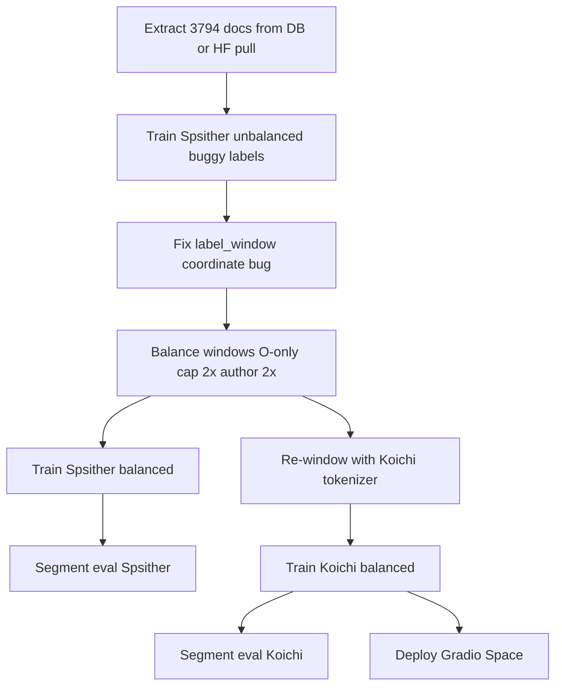

# Tibetan Metadata NER — Experiment Report (Jun 2026)

End-to-end record of training experiments for **title** and **author** span detection in Tibetan text segments, from first Spsither RoBERTa runs through balanced retraining and the Koichi tokenizer comparison.

**Repository:** [OpenPecha/tibetan-text-meta-detection](https://github.com/OpenPecha/tibetan-text-meta-detection)

---

## 1. Task and data

| Item | Value |
|------|-------|
| **Task** | Token-classification NER (BIO) for `title` and `author` spans |
| **Source** | BDRC outliner exports (`outliner_segments` with `title_span_*` / `author_span_*`) |
| **Documents** | 3,794 approved documents with annotated TEXT segments |
| **Extracted dataset** | [ganga4364/tibetan-metadata-extracted](https://huggingface.co/datasets/ganga4364/tibetan-metadata-extracted) |
| **Window geometry** | 512 subword tokens, stride 256, up to 15 begin + 15 end slides (overlap-aware dedup) |
| **Labels** | `O`, `B-TITLE`, `I-TITLE`, `B-AUTHOR`, `I-AUTHOR` |

Inference (training and deployment) uses **sliding windows** over each segment, then merges overlapping predictions — never a single forward pass over an entire long segment.

---

## 2. GPU and infrastructure

### Hardware (VastAI instances used)

| Spec | Value |
|------|-------|
| **GPU** | NVIDIA GeForce RTX 4090 (24 GB VRAM) |
| **Typical disk** | ~194 GB root volume |
| **OS** | Ubuntu 22.04 (VastAI template) |
| **Driver (after instance restart)** | NVIDIA 580.159.03, CUDA 13.0 |

### Software stack

| Package | Notes |
|---------|-------|
| Python | 3.10 |
| PyTorch | CUDA build (fp16 training when GPU available) |
| transformers | RoBERTa token classification |
| datasets | Memory-mapped JSONL / HF Parquet loading |
| accelerate | Required by HuggingFace Trainer |
| seqeval | Window-level span F1 during training |

### SSH access

Configured in `~/.ssh/config` as `Host vastai` (port 40028). See [GPU_INSTANCE.md](GPU_INSTANCE.md) for bootstrap commands.

---

## 3. Experiment timeline



### Phase A — Spsither, unbalanced, buggy labels (deprecated)

**What we did**

- Windowed 3,794 docs with `spsither/tibetan_RoBERTa_S_e3` tokenizer
- **No** O-only window balancing; ~1.06M raw windows → ~819k train (80/10/10 split)
- Trained 3 epochs with class-weighted loss (`entity_weight=10`)
- **Bug:** `label_window` used segment-global offsets instead of window-relative offsets, so begin/end sliding windows often received all-`O` labels

**Window test metrics** (misleading — do not compare to later runs)

| Metric | Value |
|--------|-------|
| Span F1 | ~14.9% |
| Title F1 | ~16.5% |
| Author F1 | ~1.4% |
| Test loss | ~0.0066 (misleadingly low — predicts mostly `O`) |

Segment-level eval was **not** run. Old HF dataset splits (819k/93k/109k) on [ganga4364/tibetan-metadata-detector](https://huggingface.co/datasets/ganga4364/tibetan-metadata-detector) reflect this era — **do not use for new training**.

See [metrics/spsither_unbalanced_window.json](metrics/spsither_unbalanced_window.json).

---

### Phase B — Label fix + window balancing (Spsither)

**What we fixed**

1. **Window-relative BIO labeling** in `pipeline/roberta_windows.py` (`label_window`, roundtrip validation)
2. **Tests** in `tests/test_label_window.py` (begin_00, begin_01, end windows, roundtrip)
3. **`balance-windows`** in `prepare_data.py`:
   - `O_ONLY_CAP_RATIO = 2.0` — keep at most 2× O-only windows per entity window per segment
   - `AUTHOR_OVERSAMPLE = 2` — duplicate author-bearing windows
   - SQLite streaming to avoid RAM OOM on ~1M rows

**Data pipeline (Spsither)**

| Stage | Count |
|-------|-------|
| Raw windows | 1,061,770 |
| After balance | 274,422 |
| Train / val / test | 241,377 / 2,688 / 30,357 |
| Split | 89% / 1% / 10% (document-stratified) |

Balanced splits pushed to HF: [ganga4364/tibetan-metadata-detector](https://huggingface.co/datasets/ganga4364/tibetan-metadata-detector) (Parquet, `default` config).

**Training (Spsither balanced)** — see [§4 Training hyperparameters](#4-training-hyperparameters)

**Window test metrics** (30,357 test windows)

| Metric | Value |
|--------|-------|
| Span F1 | **3.1%** |
| Title F1 | **7.4%** |
| Author F1 | **1.0%** |

**Segment test metrics** (6,492 segments, exact span match via `eval_segment.py`)

| Metric | F1 | Precision | Recall |
|--------|-----|-----------|--------|
| Span (exact) | **8.0%** | 5.4% | 15.3% |
| Title | **12.7%** | — | — |
| Author | **0.7%** | — | — |

Model: [ganga4364/tibetan-metadata-roberta-ner](https://huggingface.co/ganga4364/tibetan-metadata-roberta-ner)

See [metrics/spsither_balanced_window.json](metrics/spsither_balanced_window.json) and [metrics/spsither_balanced_segment.json](metrics/spsither_balanced_segment.json).

**Key insight:** Window F1 **dropped** from ~15% to ~3% after fixing labels — the old number was inflated by the bug. **Segment-level** eval (deployment-like) is the fairer metric for inference quality.

---

### Phase C — Koichi tokenizer comparison

**Motivation:** Compare `KoichiYasuoka/roberta-base-tibetan` vs `spsither/tibetan_RoBERTa_S_e3` with **identical** data, balance settings, splits ratios, and training hyperparameters. Koichi requires **re-windowing** (different subword boundaries) — cannot reuse Spsither windows or the Spsither-tokenized HF dataset for training.

**Data pipeline (Koichi)**

| Stage | Count |
|-------|-------|
| Raw windows (6 workers) | 934,690 |
| After balance | 253,605 |
| O-only dropped | 732,743 |
| Author duplicates added | 51,658 |
| Train / val / test | 222,320 / 2,788 / 28,497 |

**Training fixes for Koichi**

- `CrossEntropyLoss(ignore_index=-100)` for CLS/SEP padding labels
- `ensure_position_capacity(model, 514)` — Koichi pretrained with 512 position embeddings; 512-token windows need position index 512 (Spsither has 514)

**Window test metrics** (28,497 test windows)

| Metric | Koichi | Spsither (Phase B) |
|--------|--------|---------------------|
| Span F1 | **12.3%** | 3.1% |
| Span precision | 7.8% | 1.8% |
| Span recall | **29.2%** | 13.9% |
| Title F1 | **15.8%** | 7.4% |
| Author F1 | **9.4%** | 1.0% |
| Test loss | 0.122 | — |

**Segment test metrics** (6,683 segments, exact span match)

| Metric | Koichi | Spsither (Phase B) |
|--------|--------|---------------------|
| Span F1 | 7.4% | **8.0%** |
| Span precision | 4.5% | **5.4%** |
| Span recall | **21.7%** | 15.3% |
| Title F1 | **15.2%** | 12.7% |
| Author F1 | 0.4% | **0.7%** |

Koichi segment eval: TP 1,779 / FP 38,188 / FN 6,415 (span); high recall but many false positives after window merge.

Model: [ganga4364/tibetan-metadata-koichi-ner](https://huggingface.co/ganga4364/tibetan-metadata-koichi-ner)

Local data path on instance: `data/roberta_koichi/` (not uploaded as HF dataset — train from local splits only).

See [metrics/koichi_balanced_window.json](metrics/koichi_balanced_window.json) and [metrics/koichi_balanced_segment.json](metrics/koichi_balanced_segment.json).

---

## 4. Training hyperparameters

Shared across **Phase B (Spsither balanced)** and **Phase C (Koichi)** unless noted.

| Parameter | Value |
|-----------|-------|
| `epochs` | 3 |
| `batch_size` (train) | 64 |
| `eval_batch_size` | 64 |
| `learning_rate` | 2e-5 |
| `weight_decay` | 0.01 |
| `entity_weight` (O vs entity in loss) | 10 |
| `eval_steps` / `save_steps` | 2000 |
| `max_val_samples` | 10,000 (live val subset during training) |
| `eval_strategy` | steps |
| `load_best_model_at_end` | True |
| `metric_for_best_model` | `span_f1` |
| `fp16` | True when CUDA available |
| `dataloader_num_workers` | 4 |
| `optimizer` | AdamW (Trainer default) |
| Split seed | 42 |

**Spsither training command (from HF dataset)**

```bash
python train_roberta.py \
  --hf-dataset ganga4364/tibetan-metadata-detector \
  --hf-config default \
  --output-dir data/roberta_full/model \
  --batch-size 64 \
  --epochs 3 \
  --entity-weight 10 \
  --eval-steps 2000 \
  --save-steps 2000 \
  --max-val-samples 10000
```

**Koichi training command (local splits only)**

```bash
python train_roberta.py \
  --model KoichiYasuoka/roberta-base-tibetan \
  --splits-dir data/roberta_koichi/splits \
  --output-dir data/roberta_koichi/model \
  --batch-size 64 \
  --epochs 3 \
  --entity-weight 10 \
  --eval-steps 2000 \
  --save-steps 2000 \
  --max-val-samples 10000
```

**Balancing defaults** (`config.py`)

| Setting | Value |
|---------|-------|
| `O_ONLY_CAP_RATIO` | 2.0 |
| `AUTHOR_OVERSAMPLE` | 2 |
| `TRAIN_RATIO` / `VAL_RATIO` / `TEST_RATIO` | 0.89 / 0.01 / 0.10 |

---

## 5. Evaluation methodology

### Window-level (`test_metrics.json`)

- Produced automatically at end of `train_roberta.py`
- **seqeval** entity-level span F1 on individual 512-token windows
- Does **not** merge windows — optimistic for long segments

### Segment-level (`segment_test_metrics.json`)

```bash
python eval_segment.py \
  --model <path-or-hf-id> \
  --extracted-dir data/extracted \
  --splits-dir <splits-dir> \
  --output <output.json>
```

- Uses `pipeline/inference.py` → `predict_segment()` (same as Gradio Space)
- Test segments = unique `(doc_id, segment_id)` from `test.jsonl` with gold annotations
- **Exact span match:** predicted `(label, span_start, span_end)` must equal gold
- Deployment-like; stricter than window F1

---

## 6. Master results table

| Run | Base model | Balance | Labels fixed | Window span F1 | Window title F1 | Window author F1 | Segment span F1 | Segment title F1 | Segment author F1 |
|-----|------------|---------|--------------|----------------|-----------------|------------------|-----------------|------------------|-------------------|
| A — Spsither unbalanced | spsither/tibetan_RoBERTa_S_e3 | No | **No** | ~14.9%* | ~16.5%* | ~1.4%* | — | — | — |
| B — Spsither balanced | spsither/tibetan_RoBERTa_S_e3 | Yes | Yes | 3.1% | 7.4% | 1.0% | 8.0% | 12.7% | 0.7% |
| C — Koichi balanced | KoichiYasuoka/roberta-base-tibetan | Yes | Yes | **12.3%** | **15.8%** | **9.4%** | 7.4% | **15.2%** | 0.4% |

\*Phase A metrics are **not comparable** to B/C due to labeling bug.

### Conclusions

1. **Label fix + balancing** are required for meaningful training; unbalanced buggy-label F1 was misleading.
2. **Koichi wins on window-level** metrics across span, title, and author.
3. **Segment-level** (what the Space uses): Koichi is better on **title** (+2.5 pp F1); Spsither is slightly better on **span** and **author**; both remain low overall.
4. **Author detection** is the hardest label for both tokenizers at segment level (~0.4–0.7% F1).
5. Koichi’s high segment recall (21.7%) comes with many false positives (38k FP) — merge/threshold tuning may help.

---

## 7. Gradio demo

| Item | Link |
|------|------|
| **Space (currently Koichi model)** | [ganga4364/tibetan-metadata-highlight](https://huggingface.co/spaces/ganga4364/tibetan-metadata-highlight) |
| **Local on GPU instance** | `cd space && python app.py` → port 7860 |

The Space uses the same `predict_segment` + `highlight_spans` pipeline as segment eval.

---

## 8. Hugging Face resources

### Datasets

| Resource | URL | Description |
|----------|-----|-------------|
| Extracted documents | [ganga4364/tibetan-metadata-extracted](https://huggingface.co/datasets/ganga4364/tibetan-metadata-extracted) | 3,794 docs — texts + annotations (source for all runs) |
| Spsither window splits | [ganga4364/tibetan-metadata-detector](https://huggingface.co/datasets/ganga4364/tibetan-metadata-detector) | Balanced train/val/test Parquet (Spsither tokenizer only) |

### Models

| Resource | URL | Base | Window span F1 | Segment span F1 |
|----------|-----|------|----------------|-----------------|
| Spsither NER | [ganga4364/tibetan-metadata-roberta-ner](https://huggingface.co/ganga4364/tibetan-metadata-roberta-ner) | [spsither/tibetan_RoBERTa_S_e3](https://huggingface.co/spsither/tibetan_RoBERTa_S_e3) | 3.1% | 8.0% |
| Koichi NER | [ganga4364/tibetan-metadata-koichi-ner](https://huggingface.co/ganga4364/tibetan-metadata-koichi-ner) | [KoichiYasuoka/roberta-base-tibetan](https://huggingface.co/KoichiYasuoka/roberta-base-tibetan) | 12.3% | 7.4% |

Each model repo includes `test_metrics.json` (window) and `segment_test_metrics.json` (segment, where uploaded).

### Demo Space

| Resource | URL |
|----------|-----|
| Tibetan Metadata Highlight | [ganga4364/tibetan-metadata-highlight](https://huggingface.co/spaces/ganga4364/tibetan-metadata-highlight) |

### Code

| Resource | URL |
|----------|-----|
| GitHub repository | [OpenPecha/tibetan-text-meta-detection](https://github.com/OpenPecha/tibetan-text-meta-detection) |

---

## 9. Related documentation

| Doc | Purpose |
|-----|---------|
| [GPU_INSTANCE.md](GPU_INSTANCE.md) | Step-by-step instance bootstrap, windowing, train, upload |
| [metrics/](metrics/) | Machine-readable JSON metrics per run |
| [../README.md](../README.md) | Project overview and quick start |
| [../hub/model_README.md](../hub/model_README.md) | Spsither model card template |
| [../hub/model_koichi_README.md](../hub/model_koichi_README.md) | Koichi model card template |

---

## 10. Reproducing after instance teardown

All durable artifacts are on **GitHub** (code, docs) and **Hugging Face** (extracted data, Spsither splits, both models, Space). No PostgreSQL required on a new GPU instance.

```bash
git clone https://github.com/OpenPecha/tibetan-text-meta-detection.git
cd tibetan-text-meta-detection
pip install -r requirements.txt
bash scripts/run_pull_extracted.sh

# Spsither: train from HF
python train_roberta.py --hf-dataset ganga4364/tibetan-metadata-detector ...

# Koichi: must re-window locally, then train from data/roberta_koichi/splits
NUM_WORKERS=6 bash scripts/start_roberta_koichi_multiworker.sh
bash scripts/resume_koichi_balance_split.sh
bash scripts/start_train_koichi_tmux.sh
```

---

*Report generated Jun 2026. Instance: VastAI RTX 4090, OpenPecha/tibetan-text-meta-detection.*
